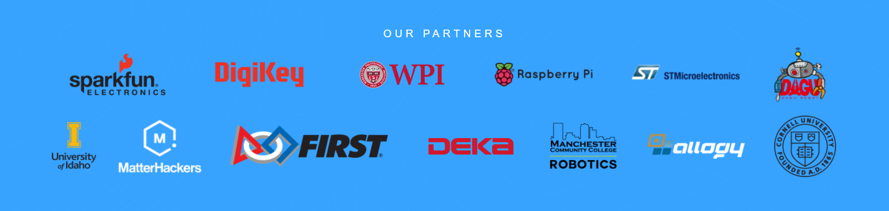

# Welcome to the WPI XRP Club!

We're a group of students from Worcester Polytechnic Institute (WPI), Massachusetts, working on the XRP!

## What is the XRP?

The Experential Robotics Platform (XRP) is an open-robotics platform designed to help you take your first steps into engineering, robotics, and software development. The XRP is not only simple, inexpensive, and easy to build, but includes access to a free open curriculum developed by Worcester Polytechnic Institute (WPI) through its OpenSTEM platform—guiding even the novice user.

